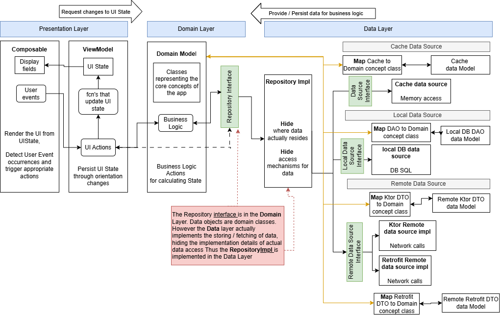
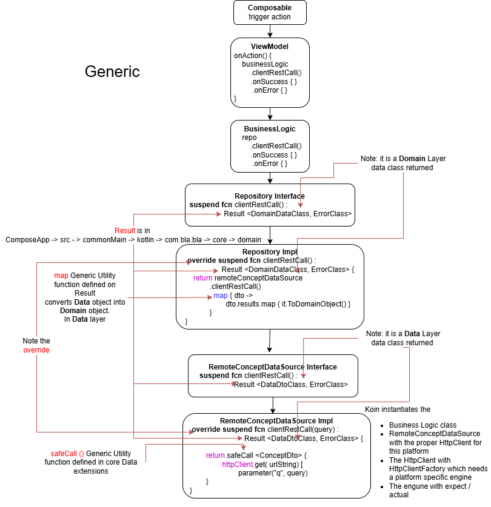
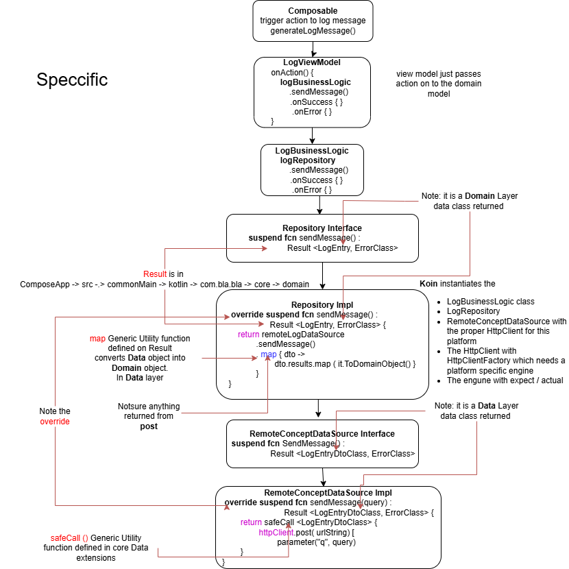

This is a Kotlin Multiplatform project targeting Android, iOS, Desktop, Server.

* `/composeApp` is for code that will be shared across your Compose Multiplatform applications.
  It contains several subfolders:
  - `commonMain` is for code that’s common for all targets.
  - Other folders are for Kotlin code that will be compiled for only the platform indicated in the folder name.
    For example, if you want to use Apple’s CoreCrypto for the iOS part of your Kotlin app,
    `iosMain` would be the right folder for such calls.

* `/iosApp` contains iOS applications. Even if you’re sharing your UI with Compose Multiplatform, 
  you need this entry point for your iOS app. This is also where you should add SwiftUI code for your project.

* `/server` is for the Ktor server application.

* `/shared` is for the code that will be shared between all targets in the project.
  The most important subfolder is `commonMain`. If preferred, you can add code to the platform-specific folders here too.

Learn more about [Kotlin Multiplatform](https://www.jetbrains.com/help/kotlin-multiplatform-dev/get-started.html)…

# Compose Multiplatform NetworkExample App

# Introduction

This project is an example of a Kotlin Multiplatform project that uses Compose for the UI. 
The main purpose of this project is to gain experience:
* building a Kotlin Multiplatform project
* building a REST app based on Ktor 
* that has both a client side and a server side.

# Architecture images

## Ktor Clean Code Architecture

## Ktor Client Calls

# Requirements
* Include a logger module that can be reused in other projects
* Include some problem domain concept model, eg sensor data

# Architecture Notes
The project uses State of the Art Android Architecture circa 2025. It uses:
* Compose Kotlin Multiplatform
* Kotlin 100%
* Compose for building UI
  * Compose NavGraph navigation
* Koin for Dependency Injection
  * For now, the only classes that are injected are the ViewModel and Repository
* Ktor for Network calls
* Coil for loading images from network URLs
* Accompanist for permissions
* FusedLocationProvider from GooglePlayServices for location management
* MVI to
  * persist UI local cache across orientation changes
  * UI state variables governing UI compose
    * Enable state hoisting
  * business logic to calculate values for UI display (i.e. state)
  * business logic for actions in response to UI events
* Repository to separate business logic from Data Source
  * Examples of both localDataSource and remoteDataSource
  * localDataSource is ROOM DB
  * remoteDataSource is Ktor
* Use Flows to move UI state data back to UI compose (via the ViewModel) from Repository
* Coroutines for both serial and parallel structured concurrency
* Unit Testing
  * Ktor unit tests
  * DB instrumented test 
    * These need to run on a real device
    * best resource for room DB testing https://medium.com/@wambuinjumbi/unit-testing-in-android-room-361bf56b69c5
  * Compose UI testing
    * reference https://developer.android.com/codelabs/jetpack-compose-testing#0
*

## Update secrets
* add secret to local.properties
* Load the secret from BuildConfig

## Update Dependency Injection i.e. Koin

## Update Permissions

## Change UI
* Add new UI ScreenRoute files under UI package
  * Replace WeatherRoute with your new screen
* Update NavGraph to add new screens
* Call the appropriate UI compose function from MainActivity
* Update MainContract

## Update ViewModel
* Add new ViewModel files under ViewModel package
  * Replace WeatherViewModel with your new ViewModel

## Update Repository

* Add new Repository files under Repository package
  * Replace WeatherRepository with your new Repository
  * Replace WeatherRepositoryImpl with your new RepositoryImpl
  * Replace WeatherRepositoryImplTest with your new RepositoryImplTest
  * Replace WeatherRepositoryImplInstrumentedTest with your new RepositoryImplInstrumentedTest

## Update Data Source

## Update Data Model

## Update Network i.e. Retrofit

## Update Local Storage i.e. Room

## Update Unit Tests